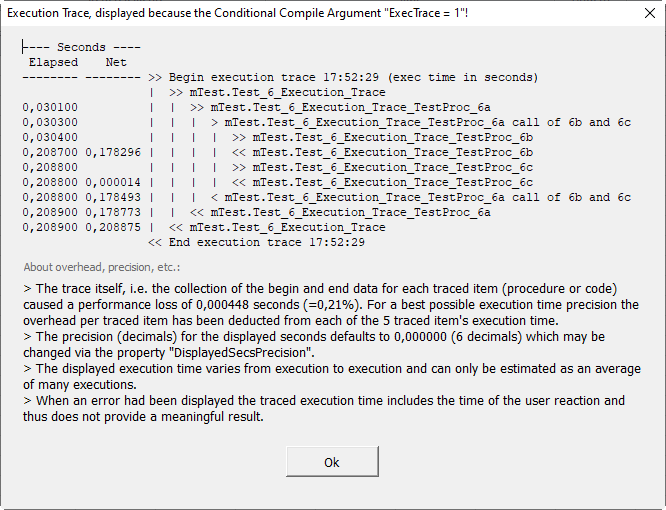

# Common VBA Execution Trace

## Service
Displays a compact

or a very detailed

execution trace which includes all executed procedures which have BoP/EoP statements in an executed procedure or BoC/EoC statements in an executed part of code.

## Constraints
This execution trace module is an optional component of the _Common VBA Error Handler_ (see the corresponding [blog post](#https://warbe-maker.github.io/vba/common/2020/10/02/Comprehensive-Common-VBA-Error-Handler.html)). The execution trace will function identically when installed without the error handler it but requires some more steps to install it.

## Installation
- Download (not required when the mErH module is installed)  [fMsg.frm](https://gitcdn.link/repo/warbe-maker/VBA-MsgBox-alternative/master/fMsg.frm) and   [fMsg.frx](https://gitcdn.link/repo/warbe-maker/VBA-MsgBox-alternative/master/fMsg.frx) and import _fMsg.frm_
- Download  [mTrc.frm](https://gitcdn.link/repo/warbe-maker/Trc/master/mTrc.bas) and import it
- Copy the following to any module with to-be-traced procedures:<br>
```vbs
Private Function ErrSrc(ByVal s As String) As String
   ErrSrc = "module-name." & s
End Function
```
Copy the flowing to any standard module (not required when the mErH module is installed):
```vbs
' ----------------------------------------------------------------------
' Deklarations for the use of the fMsg UserForm (Alternative VBA MsgBox)
Public Enum StartupPosition         ' ---------------------------
    Manual = 0                      ' Used to position the
    CenterOwner = 1                 ' final setup message form
    CenterScreen = 2                ' horizontally and vertically
    WindowsDefault = 3              ' centered on the screen
End Enum                            ' ---------------------------

Public Type tSection                ' ------------------
       sLabel As String             ' Structure of the
       sText As String              ' UserForm's
       bMonspaced As Boolean        ' message area which
End Type                            ' consists of
Public Type tMessage                ' three message
       section(1 To 3) As tSection  ' sections
End Type                            ' -------------------
' ----------------------------------------------------------------------
```

## Usage
Code in any to be traced procedure:
```vbs
Private Sub Any()
    Const PROC = "Any"
    '...
    
    mTrc.BoP ErrSrc(PROC)
    ' any code lines

xt: mTrc.EoP ErrSrc(PROC)
    Exit Sub
    
eh: ' any error haning
End Sub
```
Note: Never use Exit but Go-to xt instead to ensure the EoP (end of procedure) statement is not bypassed.